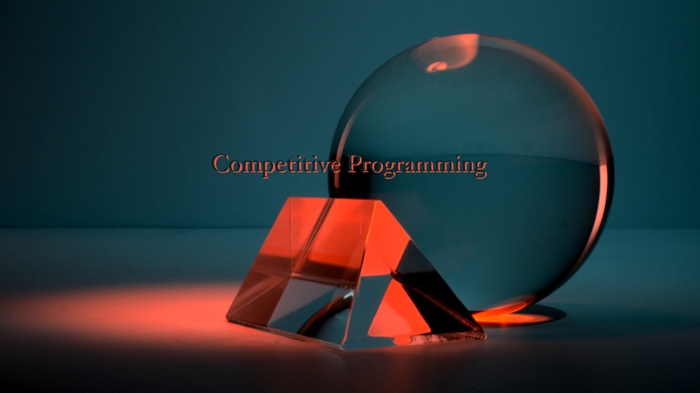
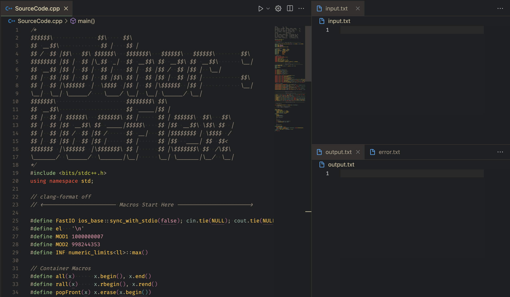
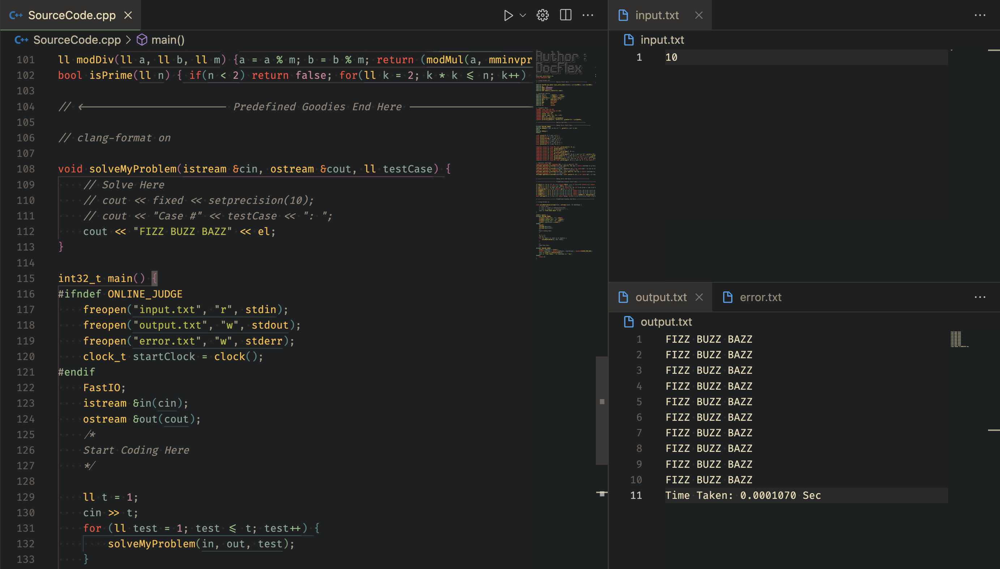

<p align="center">
  
</p>

# ✨ Competitive Programming Template ✨

Hello fellow programmer! Welcome to the **Awesome Competitive Programming Template** GitHub repository. 🚀 This repository is your go-to destination for a comprehensive and handy competitive programming template written in C++. Whether you're a seasoned coder or just getting started, this template is designed to supercharge your problem-solving skills! 🏆

## Table of Contents 📚
- [Introduction](#introduction)
- [Getting Started](#getting-started)
- [🚀 Macros](#macros)
- [📦 Container Macros](#container-macros)
- [🔖 Typedefs](#typedefs)
- [🔍 Debug Utilities](#debug-utilities)
- [🌟 Predefined Goodies](#predefined-goodies)
- [Solving Problems](#solving-problems)
- [⏱️ Time Complexity](#time-complexity)
- [Contributing](#contributing)
- [License](#license)

## Introduction 🌟

Hey there, future coding champion! 🎉 Competitive programming is like a puzzle-solving adventure. 🧩 Our template is your trusty sidekick to tackle those algorithmic challenges head-on!

<p align="center">
  
  Ideal Setup for Quick Run and Debug
</p>

## Getting Started 🚀

Excited to dive in? It's simple! Copy the amazing C++ code provided in this repository and paste it into your favorite C++ development environment or online compiler. Voilà! You've got the power of the template at your fingertips. 💪

<p align="center">
  
  Add Test Case in Input File and Hit CTRL + R to Run
</p>

## 🚀 Macros

- `FastIO`: Speed up your input/output operations with this magical macro.
- `el`: Say bye-bye to '\n'! Use this instead for a friendly newline.
- `MOD1` and `MOD2`: Ready-to-use modular constants for those modulo calculations.
- `INF`: Your personal "infinity" for comparisons. 🌌

## 📦 Container Macros

- `all(x)`: Wrangle your containers with ease, get the full range.
- `rall(x)`: Reverse the fun! Go from end to start in a snap.
- `popFront(x)`: Bye-bye first element! Remove it from your container.
- `mp(x, y)`: Create a magical `pair` with values `x` and `y`.
- `pb(x)`: Push `x` into your container (e.g., vector), like a pro.
- `ppb(x)`: Pop the last element from your container, with flair.

## 🔖 Typedefs

- `ll`: Short for `long long int` - your trusty big integer friend.
- `ull`: Say hi to `unsigned long long int` for all those positive vibes.
- `lld`: For precise calculations with a touch of decimal magic.
- `vl`: An abbreviation for `vector<ll>` - your versatile list.
- `vll`: It's like `vl`, but each element is a pair. Cool, right?
- `pll`: Say hello to `pair<ll, ll>` - two values in one! 🤝

## 🔍 Debug Utilities

Noticed a pesky bug? 🐞 Our debug utilities come to the rescue! These helpful tools are only active when you're not on an online judge.

- `debug(x)`: Peek into the value of `x` during debugging.
- `_print()`: A bunch of overloads to print various data types and containers.
- Operator overloads for input and output streams.

## 🌟 Predefined Goodies

We've got some coding superpowers lined up for you:

We've got some coding superpowers lined up for you:

- `GCD(a, b)`: The magical way to find the greatest common divisor of `a` and `b`. [Learn more](https://en.wikipedia.org/wiki/Greatest_common_divisor)
- `LCM(a, b)`: Compute the least common multiple of `a` and `b` effortlessly. [Learn more](https://en.wikipedia.org/wiki/Least_common_multiple)
- `pwr(a, b, mod)`: Ace the power of `a` raised to `b`, modulo `mod`. [Learn more](https://en.wikipedia.org/wiki/Modular_exponentiation)
- `mminvprime(a, b)`: The modular multiplicative inverse of `a` w.r.t. prime `b`. [Learn more](https://en.wikipedia.org/wiki/Modular_multiplicative_inverse)
- `modAdd`, `modMul`, `modSub`, `modDiv`: Modular arithmetic made simple! [Learn more](https://en.wikipedia.org/wiki/Modular_arithmetic)
- `isPrime(n)`: Unlock the secret to checking if `n` is prime. [Learn more](https://en.wikipedia.org/wiki/Primality_test)

## Solving Problems 🤖

Ready to conquer problems? Implement the `solveMyProblem` function. It reads from the input stream (`in`) and writes solutions to the output stream (`out`). All neatly wrapped in a test case loop!

```cpp
void solveMyProblem(istream &cin, ostream &cout, ll testCase) {
    // Your brilliant solution goes here!
}
```

## ⏱️ Time Complexity

Time is precious in competitive programming! Keep an eye on the time complexity of your solutions to ensure they're as efficient as can be.

## Contributing 🤝

Ready to add your magic touch? Feel free to contribute to this template or report any issues on our [GitHub repository](https://github.com/docflex/Competetive-Programming).

## License 📜

This project is licensed under the [MIT License](LICENSE). So feel free to create, explore, and shine!

---

*This amazing template was crafted with love by [DocFlex](https://github.com/docflex).* 🌟